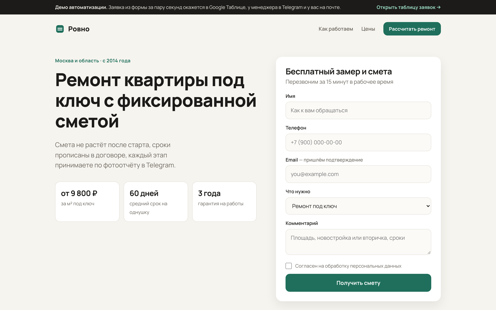
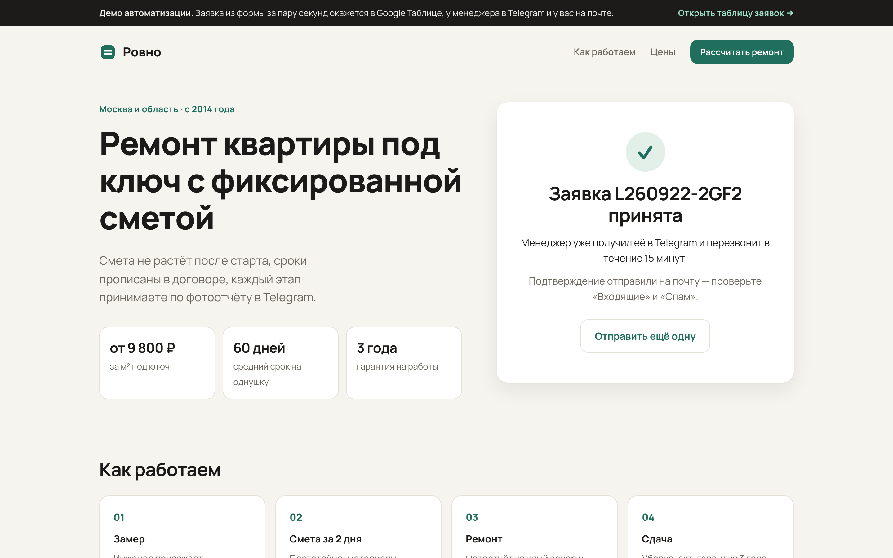
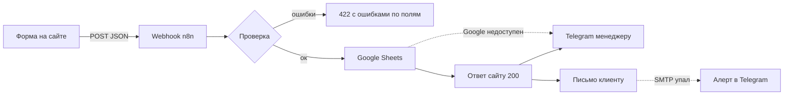

# Заявки с сайта → Google Sheets → Telegram + email · n8n lead automation

**RU** · [EN below](#english)

> Живое демо: [сайт с формой](https://your-demo.vercel.app) · [таблица заявок (только просмотр)](https://docs.google.com/spreadsheets/d/…) · видео 40 сек: [ссылка]

| Форма на сайте | Через секунду: заявка принята |
|---|---|
|  |  |


Что в этот момент прилетает менеджеру в Telegram (текст из тестового прогона):
```
🆕 Заявка L260922-2GF2
👤 Анна Смирнова
📞 +79161234567
✉️ anna@example.com
🛠 Дизайн-проект
💬 Двушка 58 м², новостройка
🔗 прямой заход
[📊 Открыть таблицу]
```

## Задача

Заявки с сайта падают на почту, менеджер видит их через час, переносит в таблицу руками,
половину забывает. Клиент не понимает, дошла ли его заявка.

## Решение

Клиент нажимает «Отправить», и за 1–2 секунды без участия человека:

1. заявка проверяется: телефон приводится к `+7…`, пустые и кривые поля отклоняются с понятной ошибкой;
2. строка появляется в Google Таблице (мини-CRM со статусом);
3. менеджер получает её в Telegram с кнопкой «Открыть таблицу»;
4. клиенту уходит письмо: «заявка №… принята, перезвоним за 15 минут».



**Защита от сбоев** (каждый пункт проверен, см. [BREAK_IT.md](BREAK_IT.md)):
- Google Таблица недоступна → заявка всё равно приходит менеджеру в Telegram с пометкой
  «⚠️ не записалась в таблицу», сайт получает «принято»;
- почта не отправилась → 3 попытки, потом отдельный алерт менеджеру;
- Telegram не отвечает → 3 попытки, потом срабатывает error-workflow;
- боты отсекаются скрытым полем (им отдаётся фальшивый 200), флуд — лимитом 5 заявок за 10 минут с одного IP;
- автоответ уходит на один адрес не чаще раза в час, поэтому форму не получится использовать для спама;
- в демо-режиме телефоны и почты в публичной таблице маскируются, менеджеру приходят полные данные.

## Стек

n8n 2.40 (self-hosted, Docker) · Google Sheets API (сервисный аккаунт) · Telegram Bot API · SMTP ·
Caddy (HTTPS) · лендинг на чистом HTML/CSS/JS без сборки.
Workflow — 12 нод, логика проверки — 100 строк JS ([`n8n/validate-lead.js`](n8n/validate-lead.js)).

```
n8n/workflow.json        основной workflow — импорт в n8n
n8n/error-workflow.json  алерт в Telegram при любом сбое
n8n/validate-lead.js     код ноды «Проверка заявки» (тот же, что внутри workflow)
n8n/sheet-template.csv   шапка таблицы
site/                    лендинг с формой (Vercel / GitHub Pages / любой хостинг)
deploy/                  docker-compose: n8n + Caddy с HTTPS
scripts/test-lead.sh     отправить тестовую заявку: ok | bad | bot | garbage | flood
```

## Установка (около 30 минут)

**1. Сервер с n8n**
```bash
ssh root@IP
curl -fsSL https://get.docker.com | sh
git clone https://github.com/nondeadted-kwork/lead-automation-n8n.git && cd lead-automation-n8n/deploy
cp .env.example .env && nano .env      # домен и N8N_ENCRYPTION_KEY (openssl rand -hex 32)
docker compose up -d
```
Откройте `https://<домен>`, создайте аккаунт владельца. Нет домена — используйте `IP-через-дефисы.sslip.io`.

**2. Google Таблица**
1. [console.cloud.google.com](https://console.cloud.google.com) → новый проект → включить **Google Sheets API**.
2. IAM → Service Accounts → создать → Keys → Add key → JSON.
3. Создать таблицу, импортировать `n8n/sheet-template.csv`, лист назвать «Заявки».
4. «Настройки доступа» → добавить email сервисного аккаунта как **Редактора**.
5. В n8n: Credentials → **Google Service Account API** → email и private key из JSON.

**3. Telegram:** @BotFather → `/newbot` → токен в n8n Credentials → **Telegram API**.
Chat id: напишите боту, откройте `https://api.telegram.org/bot<TOKEN>/getUpdates` и возьмите `chat.id`.
Для группы: добавьте бота в группу, id будет отрицательным.

**4. Почта:** Credentials → **SMTP**. Яндекс: `smtp.yandex.ru`, 465, SSL, пароль приложения.
Gmail: `smtp.gmail.com`, 465, пароль приложения.

**5. Workflow**
1. Import from File → `n8n/error-workflow.json` → выбрать Telegram credential, вписать chat id → **Publish**.
   В n8n 2.x error-workflow срабатывает, только если он опубликован.
2. Import from File → `n8n/workflow.json` → в ноде **«Настройки»** вписать ID таблицы, chat id, адрес отправителя.
3. В нодах Google Sheets / Telegram / Email выбрать свои credentials.
4. ⚙️ Settings → Error workflow → «Алерт: сбой в связке заявок». **Publish**.
5. Проверка: `./scripts/test-lead.sh https://<домен>/webhook/lead ok`.

**6. Сайт:** в `site/config.js` вписать production URL вебхука и задеплоить папку `site/`
(`npx vercel site --prod` или GitHub Pages). В ноде «Заявка с сайта» → Options → Allowed Origins
замените `*` на домен сайта.

## Под заказчика

| Задача | Сколько работы |
|---|---|
| amoCRM / Bitrix24 вместо таблицы | одна нода вместо Google Sheets, ≈1 час |
| Заявки из Tilda / Taplink / Яндекс.Форм | другой формат вебхука, правка ноды проверки, ≈30 минут |
| Распределение заявок между менеджерами | + нода Switch и счётчик, ≈1 час |
| SMS клиенту вместо письма | SMS.ru / SMSC через HTTP Request, ≈30 минут |

---

<a name="english"></a>
## English

**Website form → validation → Google Sheets → Telegram alert to the manager + confirmation email to the client, in 1–2 seconds, built in n8n.**

- Validates and normalizes input (phone → E.164), returns per-field errors (HTTP 422) the form shows inline.
- Resilient: if Google Sheets is down, the lead still reaches the manager in Telegram flagged ⚠️;
  failed emails are retried 3× and then alerted; any other failure triggers an error workflow.
- Anti-spam: honeypot field (bots get a fake 200), per-IP rate limit, one auto-reply per address per hour.
- Demo mode masks phone numbers and emails in the public sheet.

**Stack:** n8n 2.40 (self-hosted), Google Sheets API, Telegram Bot API, SMTP, Caddy, vanilla HTML/CSS/JS landing page.
Every failure path (Sheets down, SMTP down, Telegram down, junk input, bots, flood) was exercised
against a local n8n instance with mocked services. See [BREAK_IT.md](BREAK_IT.md).
